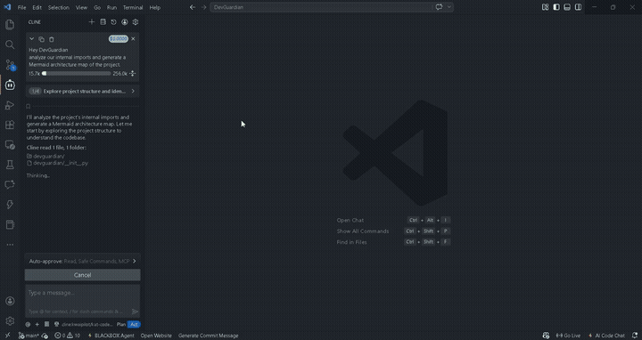

# DevGuardian MCP Server — v3 Autonomous Engineering Ecosystem

> An AI-powered, project-aware coding assistant MCP server built with Gemini 2.0 Flash and UV.  
> Plug it into Antigravity or Claude Desktop and get a full AI engineering team: debugging, reviewing, testing, deploying, and securing your code — all autonomously.



---

## What is DevGuardian?

DevGuardian v3 is a multi-agent autonomous engineering ecosystem. It goes far beyond a single script — it reads your entire project structure before acting, uses a team of AI agents to validate work iteratively, and now actively repairs its own CI failures.

**Core Design Principles:**

1. **Project DNA Awareness** — Before writing a single line of code, DevGuardian reads your README, `pyproject.toml`, full file tree, and import graph. It generates code that fits your architecture, not generic boilerplate.
2. **Agent Swarm with Adversarial Review** — A 3-agent pipeline (Coder → Tester → Reviewer) that loops until the code is production-ready. If the Reviewer rejects the code, it sends specific feedback back to the Coder for another pass (up to 3 iterations).
3. **Semantic Memory** — DevGuardian remembers your coding style preferences and lessons learned across sessions, stored locally in `.devguardian_memory.json`.
4. **Sandbox Execution** — The Tester agent actually runs the generated code in a safe subprocess to catch runtime errors, not just look for them visually.
5. **Self-Healing CI** — If a push to `main` fails CI checks, a repair job automatically triggers DevGuardian to diagnose and fix the issue, then re-pushes a repair commit.

---

## Tool Reference (31 Tools)

### Autonomous Agents

| Tool | Description |
|---|---|
| `agent_swarm` | 3-agent pipeline (Coder, Tester, Reviewer) with adversarial feedback loops and sandbox execution. Loops until code is accepted. |
| `autonomous_engineer` | Stateful LangGraph agent that plans, executes tools in loops, verifies work, and self-corrects. |

### AI Code Intelligence

| Tool | Description |
|---|---|
| `debug_error` | Analyze errors and stack traces; returns root cause and exact fix with full project context. |
| `explain_code` | Understand what any code does in plain English. |
| `review_code` | Project-aware code review covering bugs, security, performance, and style. |
| `generate_code` | Generate clean code tailored to your project's architecture. |
| `improve_code` | Refactor and improve existing code consistently. |

### Quality and Testing

| Tool | Description |
|---|---|
| `test_and_fix` | TDD Auto-Pilot: generates pytest tests, runs them, fixes source until tests pass. |
| `review_pull_request` | Fetches PR diffs from GitHub and performs an AI-powered code review. |

### DevOps and Infrastructure

| Tool | Description |
|---|---|
| `dockerize` | Auto-generates `Dockerfile` and `docker-compose.yml` tailored to your stack. |
| `generate_ci` | Auto-generates `.github/workflows/ci.yml` with linting, testing, Docker, and self-healing jobs. |
| `generate_gitignore` | Analyzes your project structure and generates a tailored `.gitignore`. Asks for permission before including `.env` patterns. |

### Architecture and Documentation

| Tool | Description |
|---|---|
| `generate_architecture_map` | Analyzes internal imports and generates a Mermaid.js dependency diagram of your project. |
| `generate_technical_docs` | Generates a high-density technical architecture summary using Gemini. |

### Mass Operations

| Tool | Description |
|---|---|
| `mass_refactor` | Applies a single instruction across every Python file in the project simultaneously. |

### Security

| Tool | Description |
|---|---|
| `validate_env` | Validates `.env` file format safely — never exposes secret values. |
| `security_scan` | Scans the repo for 20+ credential types and missing `.gitignore` coverage. |

### Git Suite

| Tool | Description |
|---|---|
| `smart_commit` | AI reads your diff, writes a commit message, scans for credential leaks, then commits. |
| `git_status` | Show working tree status. |
| `git_add` | Stage files for commit. |
| `git_commit` | Commit with a custom message. |
| `git_push` | Push to remote (protected by the security gate). |
| `git_pull` | Pull from remote. |
| `git_log` | View commit history. |
| `git_diff` | Show staged or unstaged diffs. |
| `git_branch` | List all branches. |
| `git_checkout` | Switch or create branches. |
| `git_stash` | Stash or unstash changes. |
| `git_reset` | Reset HEAD (soft, mixed, hard). |
| `git_remote` | List configured remotes. |

---

## Setup

### Prerequisites
- [UV](https://docs.astral.sh/uv/getting-started/installation/) installed
- Python 3.10+
- Git installed
- A [Gemini API Key](https://aistudio.google.com/app/apikey) (free)

### Installation

```bash
cd DevGuardian
uv venv
uv pip install -e .
```

### Configure your API key

```bash
copy .env.example .env
# Open .env and paste your Gemini API key
# Optionally add GITHUB_TOKEN for private repo PR reviews
```

### Test the server runs

```bash
uv run devguardian
```

You should see no errors — the server waits for MCP connections on stdio.

---

## MCP Configuration

### Antigravity (VS Code)
Add to your `.gemini/settings.json`:
```json
{
  "mcpServers": {
    "devguardian": {
      "command": "uv",
      "args": ["--directory", "C:\\Users\\ASUS\\OneDrive\\Desktop\\DevGuardian", "run", "devguardian"],
      "env": {
        "GEMINI_API_KEY": "your_key_here",
        "GITHUB_TOKEN": "your_github_token_here"
      }
    }
  }
}
```

### Claude Desktop
Add to `%APPDATA%\Claude\claude_desktop_config.json`:
```json
{
  "mcpServers": {
    "devguardian": {
      "command": "uv",
      "args": ["--directory", "C:\\Users\\ASUS\\OneDrive\\Desktop\\DevGuardian", "run", "devguardian"],
      "env": {
        "GEMINI_API_KEY": "your_key_here"
      }
    }
  }
}
```

---

## Usage Examples

**Agent Swarm — Build a feature with 3 AI agents**
> "DevGuardian, use the agent swarm to create a rate-limiting utility for our API."  
> Coder writes a `RateLimiter` class. Tester finds edge cases. Reviewer rejects and sends feedback. Coder fixes. Reviewer accepts on pass 2. Final production-ready file is returned.

**TDD Auto-Pilot — Test-driven bug fixing**
> "Run test_and_fix on `devguardian/tools/debugger.py`"  
> DevGuardian writes pytest tests, runs them, reads the failures, patches the source, and loops until all tests go green.

**PR Review — Review any live pull request**
> "Review PR #42 in myorg/myrepo"  
> DevGuardian fetches the diff from GitHub and produces a structured review covering bugs, security, performance, and style.

**Architecture Map — Visualize your codebase**
> "Generate an architecture map for this project."  
> DevGuardian scans all internal imports and produces a Mermaid.js dependency diagram showing how every file connects to every other file.

**Smart .gitignore — Context-aware generation**
> "Generate a gitignore for this project."  
> DevGuardian reads your tech stack and file structure. It asks for your permission before including `.env` patterns, then generates a tailored file — not a generic template.

**Push Code Safely**
> "Push my changes to main."  
> DevGuardian scans all staged files. If it detects a hardcoded API key or token, it blocks the push and reports the exact file and line number.

---

## Project Structure

```
DevGuardian/
├── .env.example                   Copy to .env and add your API key
├── .gitignore                     Security-focused ignore rules
├── pyproject.toml                 UV project config and dependencies
├── Dockerfile                     Production container
├── docker-compose.yml             Service orchestration
├── README.md
├── tests/
│   └── test_debugger.py           TDD-generated test suite
├── .github/
│   └── workflows/
│       └── ci.yml                 GitHub Actions CI/CD with self-healing job
└── devguardian/
    ├── server.py                  MCP server entry point (31 tools)
    ├── agents/
    │   ├── engineer.py            Stateful LangGraph autonomous agent
    │   └── swarm.py               3-Agent Swarm v3 with adversarial loops
    ├── tools/
    │   ├── debugger.py            debug_error
    │   ├── code_helper.py         explain, review, generate, improve
    │   ├── git_ops.py             Full git suite + smart_commit
    │   ├── tdd.py                 TDD Auto-Pilot
    │   ├── github_review.py       GitHub PR Reviewer
    │   ├── infra.py               Dockerfile, CI/CD, and gitignore generators
    │   ├── architect.py           Architecture mapping and technical docs
    │   ├── self_healing.py        CI failure detection and repair engine
    │   └── mass_refactor.py       Mass codebase refactoring
    └── utils/
        ├── gemini_client.py       Gemini 2.0 Flash wrapper
        ├── file_reader.py         Project DNA context builder
        ├── security.py            Pre-push security gate and .env validator
        ├── memory.py              Persistent semantic memory (JSON-based)
        └── executor.py            Safe subprocess execution sandbox
```

---

## Security Model

- **Anti-Leak Shield**: `security.py` detects 20+ credential types (AWS, GitHub, OpenAI, Google, Stripe, Slack) before any `git push` or `smart_commit`.
- **Precise Detection**: Only flags hardcoded quoted values — no false positives on `os.getenv()` calls.
- **Env Safety**: `validate_env` reviews your `.env` file structure — shows keys but never exposes values.
- **Permission-Based Gitignore**: The `generate_gitignore` tool asks for explicit user permission before adding `.env` patterns — nothing is done without your approval.
- **Local Execution**: Your code never leaves your machine except for Gemini API calls.

---

## CI/CD Pipeline

The pipeline runs on every push and pull request to `main`:

1. **lint** — Ruff checks code style and format
2. **test** — Pytest runs the full test suite with coverage
3. **Self-Healing Repair** — Triggers only if lint or test fails. Uses the Agent Swarm to diagnose, fix, and re-push a repair commit automatically.
4. **build** — Builds the Python package
5. **docker** — Builds the Docker image

---

## Docker

```bash
docker compose up --build
```

---

*Built by Karan using Gemini 2.0 Flash, LangGraph, MCP SDK, and UV.*
